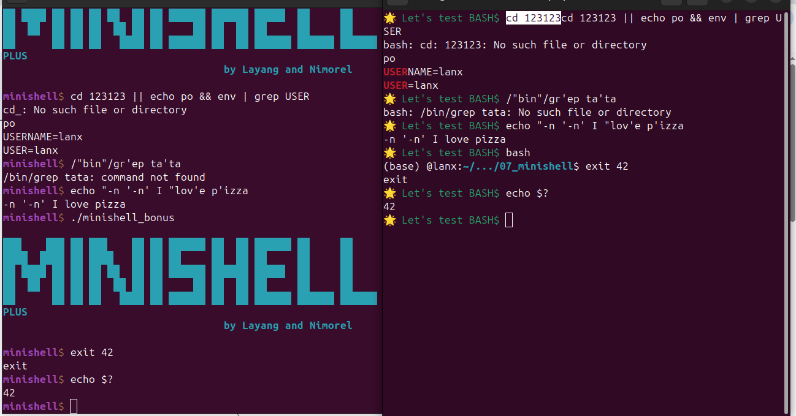
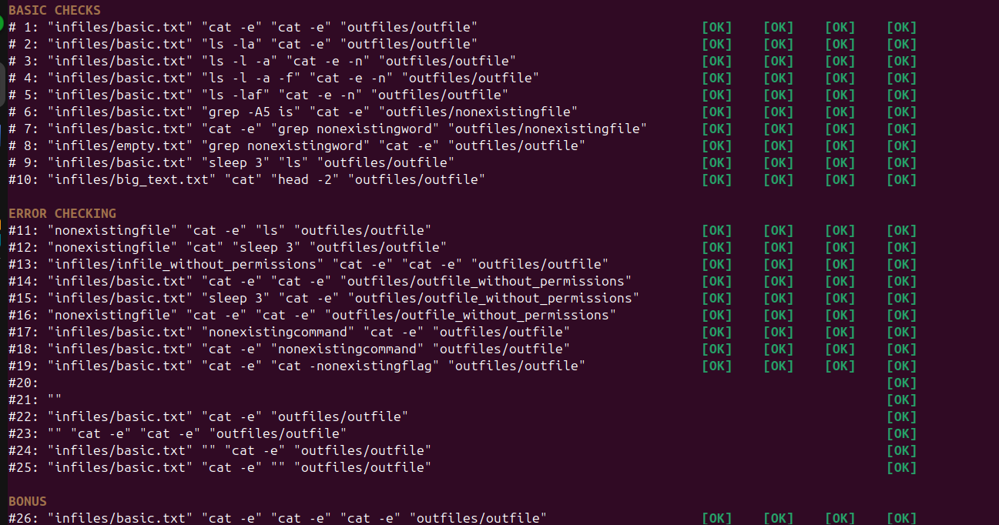

<h1 align="center">
	🐚 &emsp; Welcome to Minishell &emsp; 🐚
</h1>

*A 42's project that recreates a tiny but powerful UNIX shell, inspired by **bash** 💻*

<p align="center">  🌍 Minishell vs Bash – Test Comparison</p>
<p align="center"></p>
<p align="center">  🌍 Minishell – Test Results</p>
<p align="center"></p>

<h4 align="right">
	
  🧑🏻‍💻👩🏻‍💻 Made by [@ISDouglas](https://github.com/ISDouglas) and [@Nmorel-66](https://github.com/Nmorel-66)

</h4>

---

## 🧠 &ensp; Project Overview

**Minishell** is a simplified UNIX shell written in **C**, developed as part of the **42 School curriculum**.

The goal of this project is to understand how a real shell works internally:  
from parsing user input, to process creation, pipes, redirections, signals,  
and environment variable handling — all implemented **from scratch**.

<br>

- 🛠 Built entirely in **C (C99)**  
- 🧩 Custom lexer & parser  
- 🔀 Process management with `fork`, `execve`, `wait`  
- 📡 Signal handling (`Ctrl-C`, `Ctrl-D`, `Ctrl-\`)  
- ⭐ Includes **bonus features**

---

## 🧩 &ensp; Features

### ✅ Command Execution

- Execute commands using `PATH`
- Absolute and relative paths
- Built-in commands:
  - `echo`
  - `cd`
  - `pwd`
  - `export`
  - `unset`
  - `env`
  - `exit`

### ✅ Parsing

- Single and double quotes handling
- Environment variable expansion (`$VAR`)
- Proper syntax error detection

### ✅ Redirections & Pipes

- Input redirection `<`
- Output redirection `>`
- Append redirection `>>`
- Here-document `<<`
- Multiple pipes `|`

### ⭐ Bonus Features

- Logical operators `&&` and `||`
- Parentheses and subshells `( )`
- Wildcard expansion `*`
- Bash-like signal behavior

---

## 👷 &ensp; How to Run

### 📦 Requirements

- macOS or Linux
- `gcc` or `clang`
- Make
- `readline` library

### 🔧 Installation

```bash
git clone git@github.com:ISDouglas/minishell.git
cd minishell
make bonus
